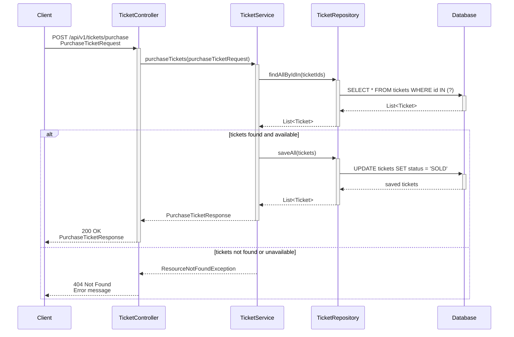
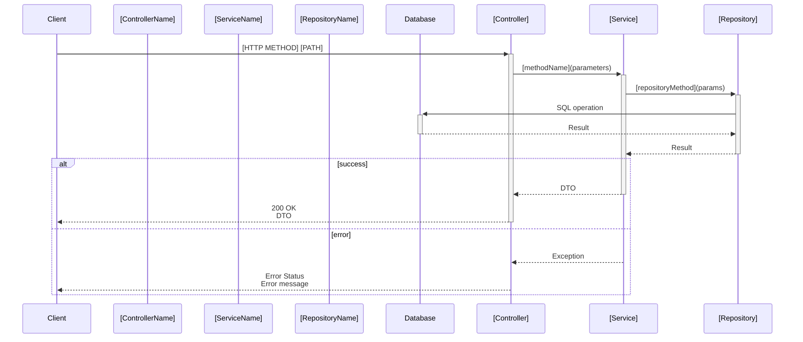

# Generatore di Sequence Diagram Mermaid per TicketBlock

## Descrizione

Questo progetto include sequence diagram in formato Mermaid per documentare il flusso dei principali endpoint REST dell'applicazione TicketBlock.

## Architettura dei Diagrammi

Ogni sequence diagram segue rigorosamente il pattern architetturale Spring Boot:

```
Client → Controller → Service → Repository → Database
```

### Attori Inclusi
- **Client**: Il consumatore dell'API (frontend, servizio esterno)
- **Controller**: Spring REST Controller che gestisce le richieste HTTP
- **Service**: Livello di business logic
- **Repository**: Livello di accesso ai dati (JPA Repository)
- **Database**: Database persistente

### Caratteristiche dei Diagrammi

1. **Chiamate Sincrone**: Tutte le interazioni sono mostrate come chiamate sincrone
2. **Parametri**: I parametri principali sono indicati (ID, DTO, ecc.)
3. **Valori di Ritorno**: Mostrati esplicitamente per ogni chiamata
4. **Gestione Errori**: Usa blocchi `alt` per rappresentare casi di successo ed errore
5. **Nomi Realistici**: Utilizza i nomi effettivi delle classi Spring del progetto

### Cosa NON È Incluso

Per mantenere i diagrammi semplici e leggibili, sono esclusi:
- Framework interni (Spring Security, Hibernate)
- Dettagli implementativi non essenziali
- Transaction management
- Logging e monitoring

## Struttura Directory

```
docs/
└── diagrams/
    ├── README.md                        # Documentazione dei diagrammi
    ├── purchase-tickets-sequence.mmd    # Acquisto biglietti
    ├── resell-ticket-sequence.mmd       # Rivendita biglietto
    ├── get-mine-tickets-sequence.mmd    # Visualizza biglietti utente
    ├── create-event-sequence.mmd        # Creazione evento
    ├── delete-event-sequence.mmd        # Eliminazione evento
    ├── get-user-sequence.mmd           # Recupero informazioni utente
    └── get-venue-sequence.mmd          # Recupero informazioni venue
```

## Come Visualizzare i Diagrammi

### Su GitHub
GitHub renderizza automaticamente i file `.mmd`. Basta aprire il file per visualizzare il diagramma.

### Con VS Code
Installa l'estensione "Markdown Preview Mermaid Support".

### Online
Copia il contenuto del file e incollalo su [Mermaid Live Editor](https://mermaid.live/).

## Esempio di Diagram

Esempio del diagramma per l'endpoint di acquisto biglietti:



## Come Aggiungere Nuovi Diagrammi

Per aggiungere il diagramma di un nuovo endpoint:

1. Identifica il Controller, Service e Repository coinvolti
2. Crea un nuovo file `.mmd` in `docs/diagrams/`
3. Segui il template fornito nel README dei diagrammi
4. Documenta sia il caso di successo che i principali casi di errore
5. Usa nomi reali delle classi e metodi del progetto

### Template Base



## Benefici

I sequence diagram Mermaid offrono:
- 📖 **Documentazione Vivente**: Aggiornabile insieme al codice
- 🎓 **Onboarding**: Aiuto per nuovi sviluppatori
- 🔍 **Code Review**: Visualizzazione del flusso durante le review
- 🏗️ **Architettura**: Comprensione della struttura dell'applicazione
- 🤝 **Comunicazione**: Facilitano discussioni tecniche

## Integrazione con CI/CD

I diagrammi possono essere:
- Validati automaticamente (sintassi Mermaid)
- Renderizzati in HTML come parte della documentazione
- Inclusi nei release notes

## Manutenzione

- Aggiorna i diagrammi quando modifichi il comportamento degli endpoint
- Rivedi i diagrammi durante le pull request
- Mantienili allineati all'implementazione reale

## Riferimenti

- [Mermaid Documentation](https://mermaid.js.org/)
- [Sequence Diagram Syntax](https://mermaid.js.org/syntax/sequenceDiagram.html)
- Spring Boot Documentation
