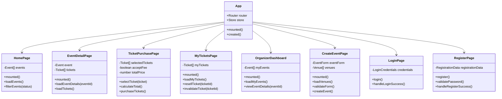
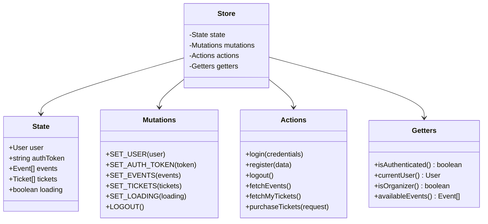
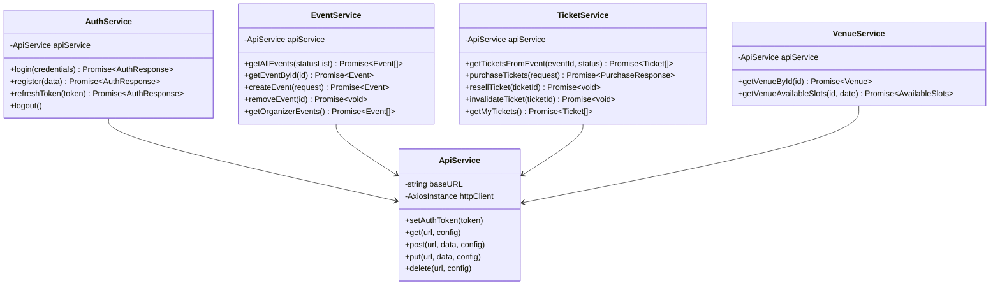
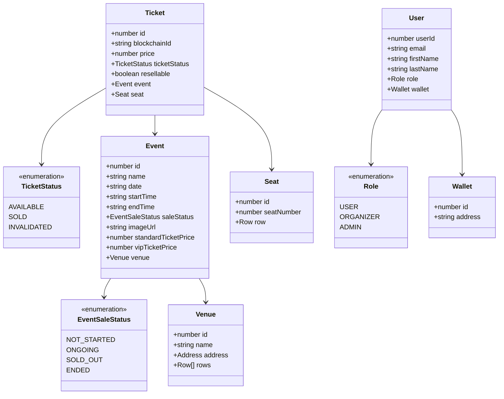
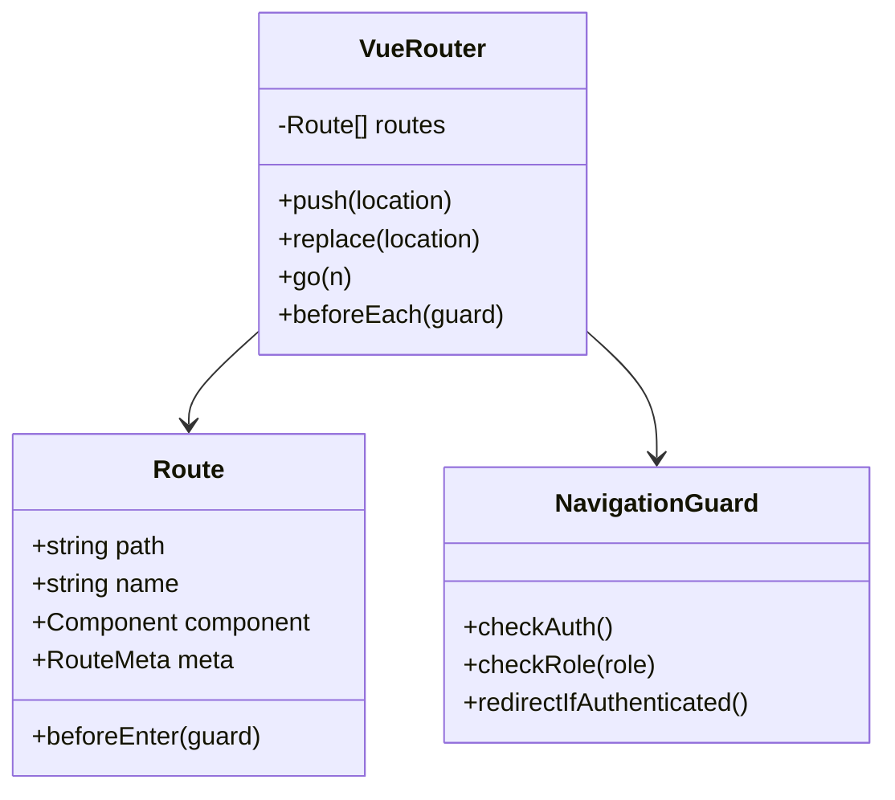
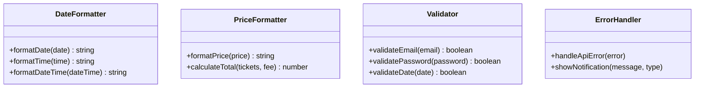

# Diagramma delle Classi UML - Frontend Vue.js

Questo diagramma mostra l'architettura del frontend Vue.js del sistema TicketBlock.

## Componenti Vue.js

## Vuex Store

## Servizi API

## Modelli e DTOs

## Router

## Utilities

## Note

**Importante**: Questo diagramma rappresenta l'architettura prevista per il frontend Vue.js che non è ancora stato implementato. Include:

- **Componenti Vue**: Pagine principali dell'applicazione
- **Vuex Store**: Gestione stato globale
- **Servizi API**: Comunicazione con backend Spring Boot
- **Router**: Navigazione tra pagine con guards
- **Models**: DTOs che rispecchiano le entità backend
- **Utilities**: Funzioni helper per formattazione e validazione

L'implementazione seguirà le best practices Vue.js 3 con Composition API e TypeScript.
