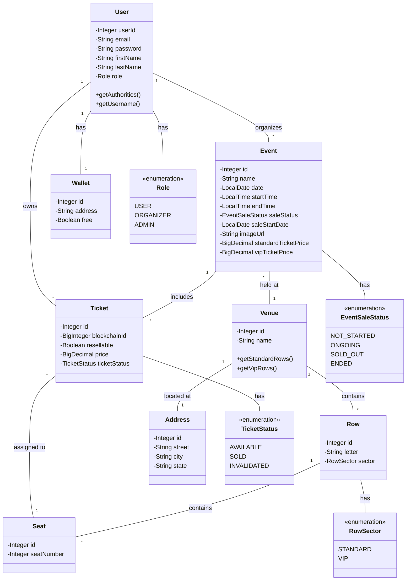

# UML Class Diagram - TicketBlock System

This diagram shows the main classes and their relationships in the TicketBlock ticketing system.

```mermaid
classDiagram
    class User {
        -Integer userId
        -String email
        -String password
        -String firstName
        -String lastName
        -Role role
        +getAuthorities()
        +getUsername()
    }

    class Event {
        -Integer id
        -String name
        -LocalDate date
        -LocalTime startTime
        -LocalTime endTime
        -EventSaleStatus saleStatus
        -LocalDate saleStartDate
        -String imageUrl
        -BigDecimal standardTicketPrice
        -BigDecimal vipTicketPrice
    }

    class Ticket {
        -Integer id
        -BigInteger blockchainId
        -Boolean resellable
        -BigDecimal price
        -TicketStatus ticketStatus
    }

    class Venue {
        -Integer id
        -String name
        +getStandardRows()
        +getVipRows()
    }

    class Row {
        -Integer id
        -String letter
        -RowSector sector
    }

    class Seat {
        -Integer id
        -Integer seatNumber
    }

    class Wallet {
        -Integer id
        -String address
        -Boolean free
    }

    class Address {
        -Integer id
        -String street
        -String city
        -String state
    }

    class EventSaleStatus {
        <<enumeration>>
        NOT_STARTED
        ONGOING
        SOLD_OUT
        ENDED
    }

    class TicketStatus {
        <<enumeration>>
        AVAILABLE
        SOLD
        INVALIDATED
    }

    class Role {
        <<enumeration>>
        USER
        ORGANIZER
        ADMIN
    }

    class RowSector {
        <<enumeration>>
        STANDARD
        VIP
    }

    User "1" -- "1" Wallet : has
    User "1" -- "*" Ticket : owns
    User "1" -- "*" Event : organizes
    Event "*" -- "1" Venue : held at
    Event "1" -- "*" Ticket : includes
    Ticket "*" -- "1" Seat : assigned to
    Venue "1" -- "1" Address : located at
    Venue "1" -- "*" Row : contains
    Row "1" -- "*" Seat : contains
    Event -- EventSaleStatus : has
    Ticket -- TicketStatus : has
    User -- Role : has
    Row -- RowSector : has
```
