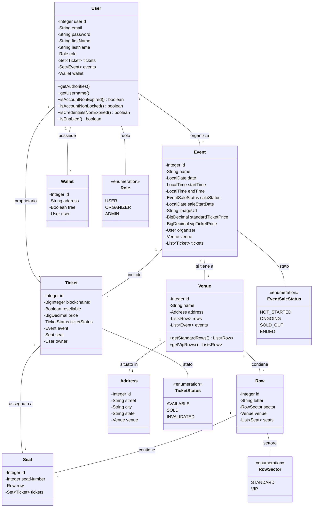
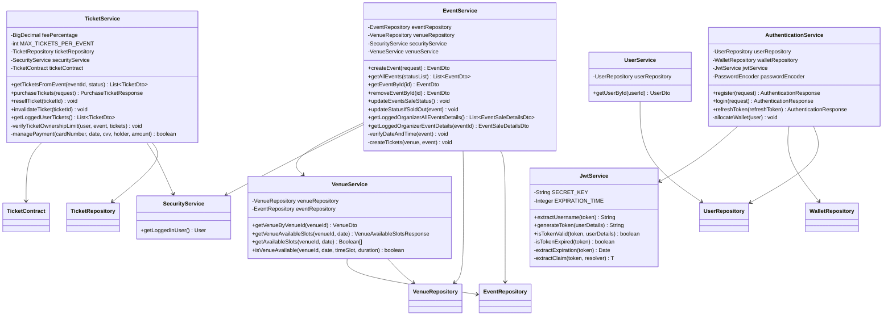
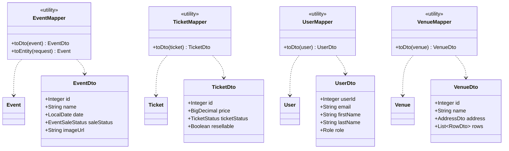
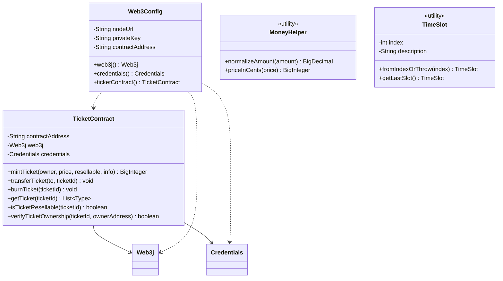
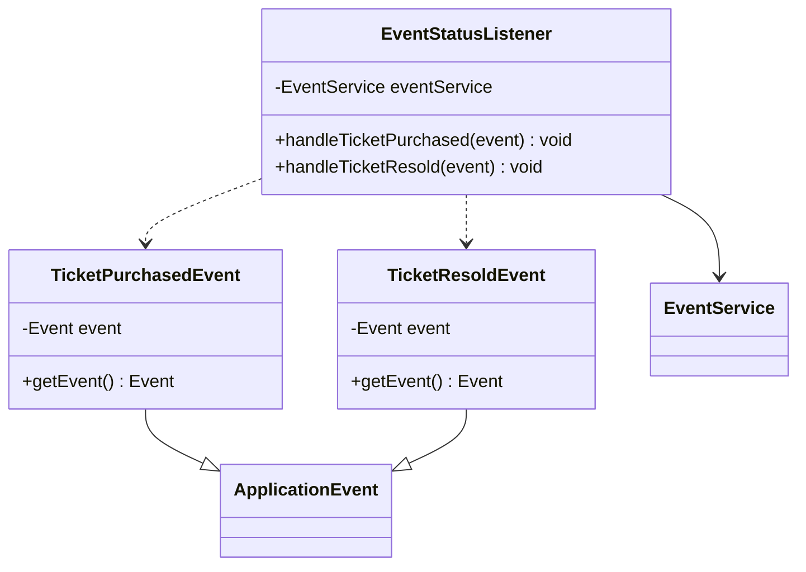

# Diagramma delle Classi UML - Sistema TicketBlock

Questo diagramma mostra le classi principali e le loro relazioni nel sistema di biglietteria TicketBlock.

## Entità di Dominio

## Livello Repository

```mermaid
classDiagram
    class UserRepository {
        <<interface>>
        +findByEmail(email) Optional~User~
    }

    class EventRepository {
        <<interface>>
        +findAllBySaleStatusIn(statusList) List~Event~
        +findAllByOrganizer(user) List~Event~
        +findAllByDate(date) List~Event~
        +findAllByDateAndVenueId(date, venueId) List~Event~
        +findAllToOpenToday() List~Event~
    }

    class TicketRepository {
        <<interface>>
        +findByEventIdAndOptionalTicketStatus(eventId, status) List~Ticket~
        +findAllByIdIn(ids) List~Ticket~
        +findAllByOwner(user) List~Ticket~
        +countAllByOwnerAndEvent(user, event) int
        +countSoldTicketsByEvent(event) int
        +countSoldTicketsByEventAndPrice(event, price) int
    }

    class VenueRepository {
        <<interface>>
        +findById(id) Optional~Venue~
    }

    class WalletRepository {
        <<interface>>
        +findFirstByFreeTrue() Wallet
        +countWalletsByFreeTrue() long
    }

    class RowRepository {
        <<interface>>
        +findById(id) Optional~Row~
    }

    class SeatRepository {
        <<interface>>
        +findById(id) Optional~Seat~
    }

    UserRepository --|> JpaRepository
    EventRepository --|> JpaRepository
    TicketRepository --|> JpaRepository
    VenueRepository --|> JpaRepository
    WalletRepository --|> JpaRepository
    RowRepository --|> JpaRepository
    SeatRepository --|> JpaRepository
```

## Livello Servizi

## Livello Controller

```mermaid
classDiagram
    class AuthenticationController {
        -AuthenticationService authenticationService
        +register(request) ResponseEntity~AuthenticationResponse~
        +login(request) ResponseEntity~AuthenticationResponse~
        +refreshToken(refreshToken) ResponseEntity~AuthenticationResponse~
    }

    class TicketController {
        -TicketService ticketService
        +getTicketsFromEvent(eventId, status) ResponseEntity~List~TicketDto~~
        +purchaseTickets(request) ResponseEntity~PurchaseTicketResponse~
        +resellTicket(ticketId) ResponseEntity~Void~
        +invalidateTicket(ticketId) ResponseEntity~Void~
        +getLoggedUserTickets() ResponseEntity~List~TicketDto~~
    }

    class OrganizerEventController {
        -EventService eventService
        +createEvent(request) ResponseEntity~EventDto~
        +removeEvent(eventId) ResponseEntity~EventDto~
        +getOrganizerEvents() ResponseEntity~List~EventSaleDetailsDto~~
        +getOrganizerEventDetails(eventId) ResponseEntity~EventSaleDetailsDto~
    }

    class PublicEventController {
        -EventService eventService
        +getAllEvents(statusList) ResponseEntity~List~EventDto~~
        +getEventById(eventId) ResponseEntity~EventDto~
    }

    class VenueController {
        -VenueService venueService
        +getVenueById(venueId) ResponseEntity~VenueDto~
        +getVenueAvailableSlots(venueId, date) ResponseEntity~VenueAvailableSlotsResponse~
    }

    class UserController {
        -UserService userService
        +getUserById(userId) ResponseEntity~UserDto~
    }

    AuthenticationController --> AuthenticationService
    TicketController --> TicketService
    OrganizerEventController --> EventService
    PublicEventController --> EventService
    VenueController --> VenueService
    UserController --> UserService
```

## Livello DTO e Mapper

## Integrazione Blockchain

## Eventi Applicativi

