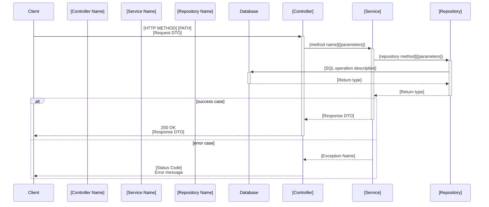

# Sequence Diagrams - TicketBlock Application

This directory contains Mermaid sequence diagrams for the TicketBlock Spring Boot application endpoints.

## Purpose

These diagrams document the flow of data through the application layers for each REST API endpoint, following the typical Spring Boot architecture pattern:
- Client → Controller → Service → Repository → Database

## Diagram Conventions

All diagrams follow these standardized rules:

### 1. Participants
Only relevant actors are included in each diagram:
- **Client**: The API consumer (frontend, external service)
- **Controller**: Spring REST Controller (`@RestController`)
- **Service**: Business logic layer (`@Service`)
- **Repository**: Data access layer (`JpaRepository`)
- **Database**: Persistent storage

### 2. Flow Structure
- Synchronous calls are shown with solid arrows (`->>`)
- Return values use dashed arrows (`-->>`)
- Parameters and return types are indicated in the messages

### 3. Error Handling
- Success and error paths are documented using `alt` blocks
- Common error scenarios include:
  - Entity not found (404)
  - Forbidden action (403)
  - Conflict/validation errors (409)

### 4. Naming Conventions
- Real Spring class names are used (e.g., `TicketController`, `TicketService`)
- HTTP methods and paths are shown (e.g., `POST /api/v1/tickets/purchase`)
- DTOs and domain objects are referenced (e.g., `PurchaseTicketRequest`, `TicketDto`)

## Available Diagrams

### Ticket Management
- **purchase-tickets-sequence.mmd**: Purchase multiple tickets for an event
- **resell-ticket-sequence.mmd**: Resell a ticket back to the marketplace
- **get-mine-tickets-sequence.mmd**: Retrieve logged-in user's tickets

### Event Management
- **create-event-sequence.mmd**: Create a new event (organizer only)
- **delete-event-sequence.mmd**: Delete an event (organizer only, with validations)

### User & Venue
- **get-user-sequence.mmd**: Retrieve user information by ID
- **get-venue-sequence.mmd**: Retrieve venue information by ID

## How to View Diagrams

### In GitHub
GitHub automatically renders `.mmd` files. Simply open any diagram file to view it.

### In VS Code
Install the "Markdown Preview Mermaid Support" extension or similar.

### In Other Tools
Copy the diagram content and paste it into:
- [Mermaid Live Editor](https://mermaid.live/)
- Any Markdown editor with Mermaid support

## Adding New Diagrams

When adding a new endpoint, create a corresponding sequence diagram following these guidelines:

### Template Structure

### Best Practices
1. **Keep it simple**: Focus on the main flow, avoid implementation details
2. **Show key decisions**: Include important conditional logic and validations
3. **Document exceptions**: Show what can go wrong and why
4. **Use realistic data**: Reference actual DTOs, entities, and method names
5. **Omit framework internals**: Don't show Spring Security filters, Hibernate sessions, etc.

## File Naming Convention

Use kebab-case with `-sequence.mmd` suffix:
- Format: `[action]-[resource]-sequence.mmd`
- Examples:
  - `purchase-tickets-sequence.mmd`
  - `create-event-sequence.mmd`
  - `get-user-sequence.mmd`

## Integration with Documentation

These diagrams complement:
- API documentation (OpenAPI/Swagger)
- Developer onboarding materials
- Architecture decision records
- Code review process

## Maintenance

- Update diagrams when endpoint behavior changes
- Review during pull requests that modify controller/service logic
- Keep aligned with actual implementation
