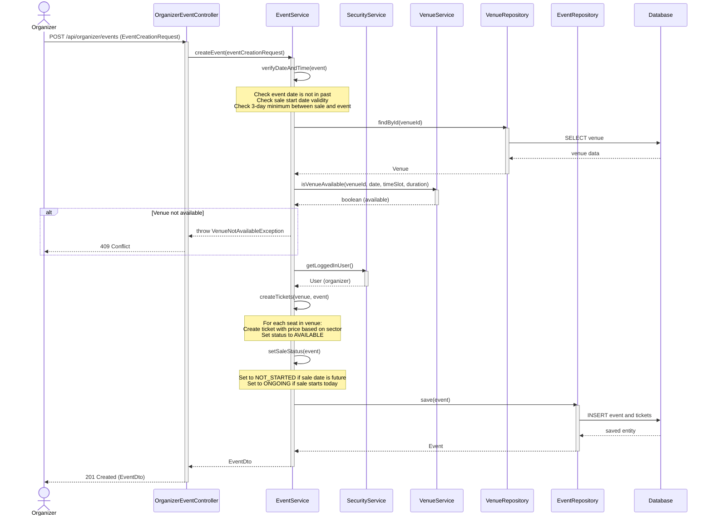

# UML Sequence Diagram - Event Creation

This diagram shows the sequence of interactions for creating a new event in the TicketBlock system.

```mermaid
sequenceDiagram
    actor Organizer
    participant Controller as OrganizerEventController
    participant Service as EventService
    participant SecurityService
    participant VenueService
    participant VenueRepo as VenueRepository
    participant EventRepo as EventRepository
    participant DB as Database

    Organizer->>Controller: POST /api/organizer/events (EventCreationRequest)
    activate Controller
    
    Controller->>Service: createEvent(eventCreationRequest)
    activate Service
    
    Service->>Service: verifyDateAndTime(event)
    Note over Service: Check event date is not in past<br/>Check sale start date validity<br/>Check 3-day minimum between sale and event
    
    Service->>VenueRepo: findById(venueId)
    activate VenueRepo
    VenueRepo->>DB: SELECT venue
    DB-->>VenueRepo: venue data
    VenueRepo-->>Service: Venue
    deactivate VenueRepo
    
    Service->>VenueService: isVenueAvailable(venueId, date, timeSlot, duration)
    activate VenueService
    VenueService-->>Service: boolean (available)
    deactivate VenueService
    
    alt Venue not available
        Service-->>Controller: throw VenueNotAvailableException
        Controller-->>Organizer: 409 Conflict
    end
    
    Service->>SecurityService: getLoggedInUser()
    activate SecurityService
    SecurityService-->>Service: User (organizer)
    deactivate SecurityService
    
    Service->>Service: createTickets(venue, event)
    Note over Service: For each seat in venue:<br/>Create ticket with price based on sector<br/>Set status to AVAILABLE
    
    Service->>Service: setSaleStatus(event)
    Note over Service: Set to NOT_STARTED if sale date is future<br/>Set to ONGOING if sale starts today
    
    Service->>EventRepo: save(event)
    activate EventRepo
    EventRepo->>DB: INSERT event and tickets
    DB-->>EventRepo: saved entity
    EventRepo-->>Service: Event
    deactivate EventRepo
    
    Service-->>Controller: EventDto
    deactivate Service
    
    Controller-->>Organizer: 201 Created (EventDto)
    deactivate Controller
```
