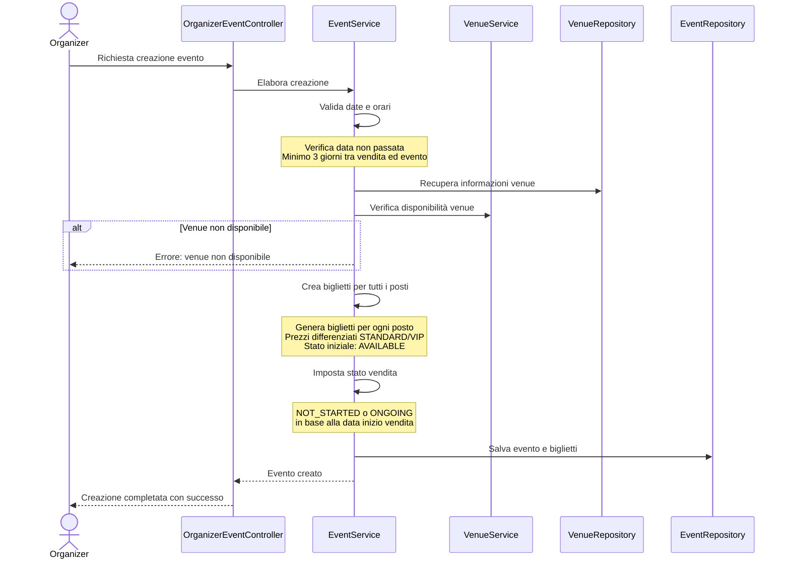

# Diagramma di Sequenza UML - Creazione Evento

Questo diagramma mostra la sequenza di interazioni per la creazione di un nuovo evento nel sistema TicketBlock.

```mermaid
sequenceDiagram
    actor Organizer
    participant OrganizerEventController
    participant EventService
    participant VenueService
    participant VenueRepository
    participant EventRepository

    Organizer->>OrganizerEventController: Richiesta creazione evento
    OrganizerEventController->>EventService: Elabora creazione
    
    EventService->>EventService: Valida date e orari
    Note over EventService: Verifica data non passata<br/>Minimo 3 giorni tra vendita ed evento
    
    EventService->>VenueRepository: Recupera informazioni venue
    
    EventService->>VenueService: Verifica disponibilità venue
    
    alt Venue non disponibile
        EventService-->>Organizer: Errore: venue non disponibile
    end
    
    EventService->>EventService: Crea biglietti per tutti i posti
    Note over EventService: Genera biglietti per ogni posto<br/>Prezzi differenziati STANDARD/VIP<br/>Stato iniziale: AVAILABLE
    
    EventService->>EventService: Imposta stato vendita
    Note over EventService: NOT_STARTED o ONGOING<br/>in base alla data inizio vendita
    
    EventService->>EventRepository: Salva evento e biglietti
    
    EventService-->>OrganizerEventController: Evento creato
    OrganizerEventController-->>Organizer: Creazione completata con successo
```
