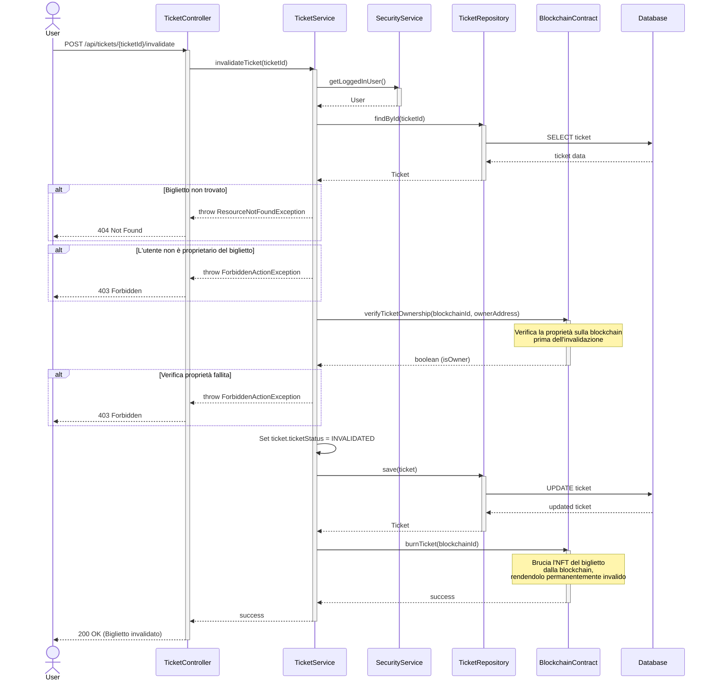

# Diagramma di Sequenza UML - Invalidazione Biglietto

Questo diagramma mostra la sequenza di interazioni per l'invalidazione di un biglietto nel sistema TicketBlock.

```mermaid
sequenceDiagram
    actor User
    participant Controller as TicketController
    participant Service as TicketService
    participant SecurityService
    participant TicketRepo as TicketRepository
    participant TicketContract as BlockchainContract
    participant DB as Database

    User->>Controller: POST /api/tickets/{ticketId}/invalidate
    activate Controller
    
    Controller->>Service: invalidateTicket(ticketId)
    activate Service
    
    Service->>SecurityService: getLoggedInUser()
    activate SecurityService
    SecurityService-->>Service: User
    deactivate SecurityService
    
    Service->>TicketRepo: findById(ticketId)
    activate TicketRepo
    TicketRepo->>DB: SELECT ticket
    DB-->>TicketRepo: ticket data
    TicketRepo-->>Service: Ticket
    deactivate TicketRepo
    
    alt Biglietto non trovato
        Service-->>Controller: throw ResourceNotFoundException
        Controller-->>User: 404 Not Found
    end
    
    alt L'utente non è proprietario del biglietto
        Service-->>Controller: throw ForbiddenActionException
        Controller-->>User: 403 Forbidden
    end
    
    Service->>TicketContract: verifyTicketOwnership(blockchainId, ownerAddress)
    activate TicketContract
    Note over TicketContract: Verifica la proprietà sulla blockchain<br/>prima dell'invalidazione
    TicketContract-->>Service: boolean (isOwner)
    deactivate TicketContract
    
    alt Verifica proprietà fallita
        Service-->>Controller: throw ForbiddenActionException
        Controller-->>User: 403 Forbidden
    end
    
    Service->>Service: Set ticket.ticketStatus = INVALIDATED
    
    Service->>TicketRepo: save(ticket)
    activate TicketRepo
    TicketRepo->>DB: UPDATE ticket
    DB-->>TicketRepo: updated ticket
    TicketRepo-->>Service: Ticket
    deactivate TicketRepo
    
    Service->>TicketContract: burnTicket(blockchainId)
    activate TicketContract
    Note over TicketContract: Brucia l'NFT del biglietto<br/>dalla blockchain,<br/>rendendolo permanentemente invalido
    TicketContract-->>Service: success
    deactivate TicketContract
    
    Service-->>Controller: success
    deactivate Service
    
    Controller-->>User: 200 OK (Biglietto invalidato)
    deactivate Controller
```
