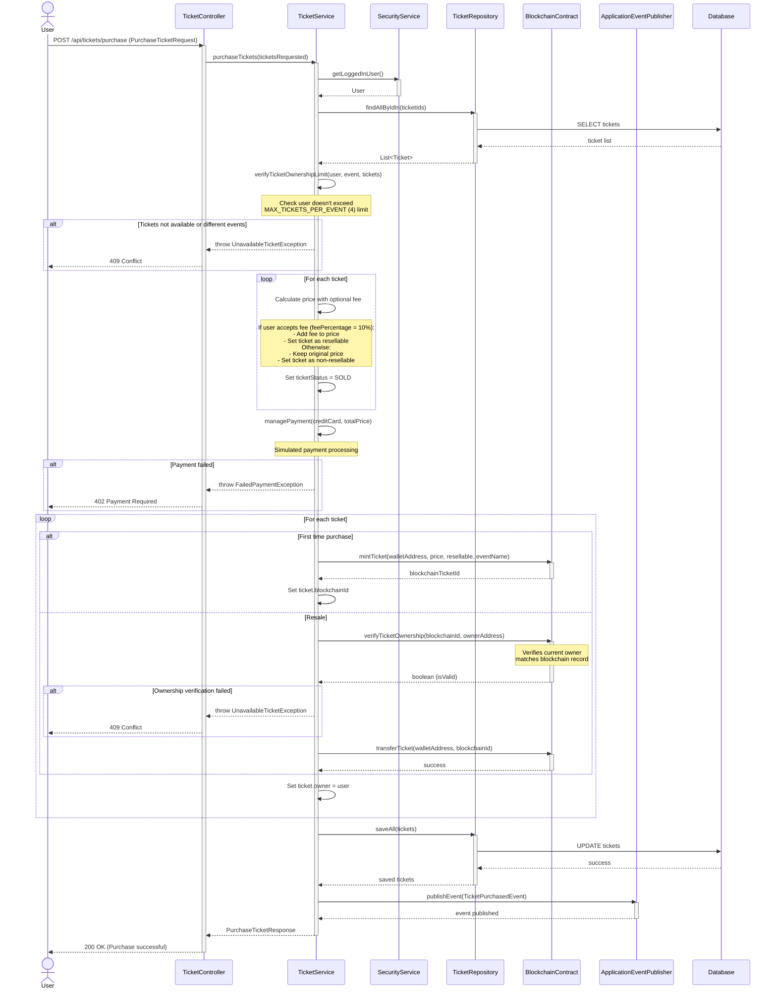

# UML Sequence Diagram - Ticket Purchase

This diagram shows the sequence of interactions for purchasing tickets in the TicketBlock system.

```mermaid
sequenceDiagram
    actor User
    participant Controller as TicketController
    participant Service as TicketService
    participant SecurityService
    participant TicketRepo as TicketRepository
    participant TicketContract as BlockchainContract
    participant EventPublisher as ApplicationEventPublisher
    participant DB as Database

    User->>Controller: POST /api/tickets/purchase (PurchaseTicketRequest)
    activate Controller
    
    Controller->>Service: purchaseTickets(ticketsRequested)
    activate Service
    
    Service->>SecurityService: getLoggedInUser()
    activate SecurityService
    SecurityService-->>Service: User
    deactivate SecurityService
    
    Service->>TicketRepo: findAllByIdIn(ticketIds)
    activate TicketRepo
    TicketRepo->>DB: SELECT tickets
    DB-->>TicketRepo: ticket list
    TicketRepo-->>Service: List<Ticket>
    deactivate TicketRepo
    
    Service->>Service: verifyTicketOwnershipLimit(user, event, tickets)
    Note over Service: Check user doesn't exceed<br/>MAX_TICKETS_PER_EVENT (4) limit
    
    alt Tickets not available or different events
        Service-->>Controller: throw UnavailableTicketException
        Controller-->>User: 409 Conflict
    end
    
    loop For each ticket
        Service->>Service: Calculate price with optional fee
        Note over Service: If user accepts fee (feePercentage = 10%):<br/>- Add fee to price<br/>- Set ticket as resellable<br/>Otherwise:<br/>- Keep original price<br/>- Set ticket as non-resellable
        Service->>Service: Set ticketStatus = SOLD
    end
    
    Service->>Service: managePayment(creditCard, totalPrice)
    Note over Service: Simulated payment processing
    
    alt Payment failed
        Service-->>Controller: throw FailedPaymentException
        Controller-->>User: 402 Payment Required
    end
    
    loop For each ticket
        alt First time purchase
            Service->>TicketContract: mintTicket(walletAddress, price, resellable, eventName)
            activate TicketContract
            TicketContract-->>Service: blockchainTicketId
            deactivate TicketContract
            Service->>Service: Set ticket.blockchainId
        else Resale
            Service->>TicketContract: verifyTicketOwnership(blockchainId, ownerAddress)
            activate TicketContract
            Note over TicketContract: Verifies current owner<br/>matches blockchain record
            TicketContract-->>Service: boolean (isValid)
            deactivate TicketContract
            
            alt Ownership verification failed
                Service-->>Controller: throw UnavailableTicketException
                Controller-->>User: 409 Conflict
            end
            
            Service->>TicketContract: transferTicket(walletAddress, blockchainId)
            activate TicketContract
            TicketContract-->>Service: success
            deactivate TicketContract
        end
        Service->>Service: Set ticket.owner = user
    end
    
    Service->>TicketRepo: saveAll(tickets)
    activate TicketRepo
    TicketRepo->>DB: UPDATE tickets
    DB-->>TicketRepo: success
    TicketRepo-->>Service: saved tickets
    deactivate TicketRepo
    
    Service->>EventPublisher: publishEvent(TicketPurchasedEvent)
    activate EventPublisher
    EventPublisher-->>Service: event published
    deactivate EventPublisher
    
    Service-->>Controller: PurchaseTicketResponse
    deactivate Service
    
    Controller-->>User: 200 OK (Purchase successful)
    deactivate Controller
```
