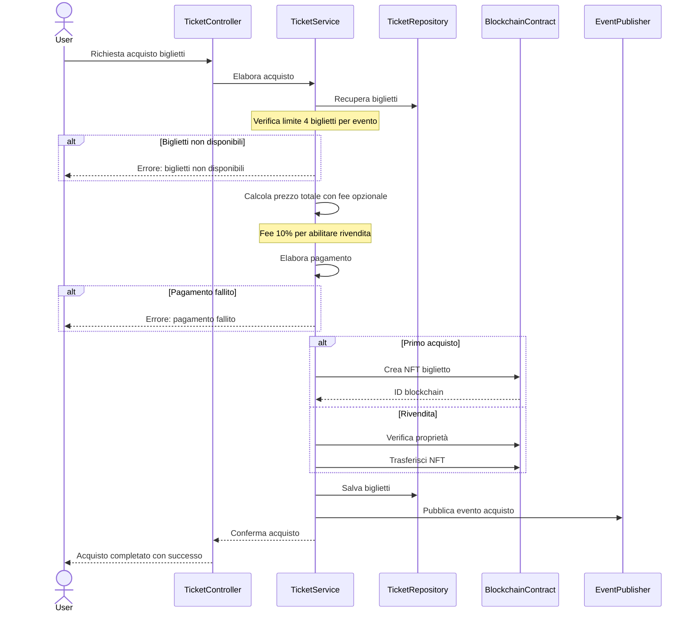

# Diagramma di Sequenza UML - Acquisto Biglietto

Questo diagramma mostra la sequenza di interazioni per l'acquisto di biglietti nel sistema TicketBlock.

```mermaid
sequenceDiagram
    actor User
    participant TicketController
    participant TicketService
    participant TicketRepository
    participant BlockchainContract
    participant EventPublisher

    User->>TicketController: Richiesta acquisto biglietti
    TicketController->>TicketService: Elabora acquisto
    
    TicketService->>TicketRepository: Recupera biglietti
    Note over TicketService: Verifica limite 4 biglietti per evento
    
    alt Biglietti non disponibili
        TicketService-->>User: Errore: biglietti non disponibili
    end
    
    TicketService->>TicketService: Calcola prezzo totale con fee opzionale
    Note over TicketService: Fee 10% per abilitare rivendita
    
    TicketService->>TicketService: Elabora pagamento
    
    alt Pagamento fallito
        TicketService-->>User: Errore: pagamento fallito
    end
    
    alt Primo acquisto
        TicketService->>BlockchainContract: Crea NFT biglietto
        BlockchainContract-->>TicketService: ID blockchain
    else Rivendita
        TicketService->>BlockchainContract: Verifica proprietà
        TicketService->>BlockchainContract: Trasferisci NFT
    end
    
    TicketService->>TicketRepository: Salva biglietti
    TicketService->>EventPublisher: Pubblica evento acquisto
    
    TicketService-->>TicketController: Conferma acquisto
    TicketController-->>User: Acquisto completato con successo
```
