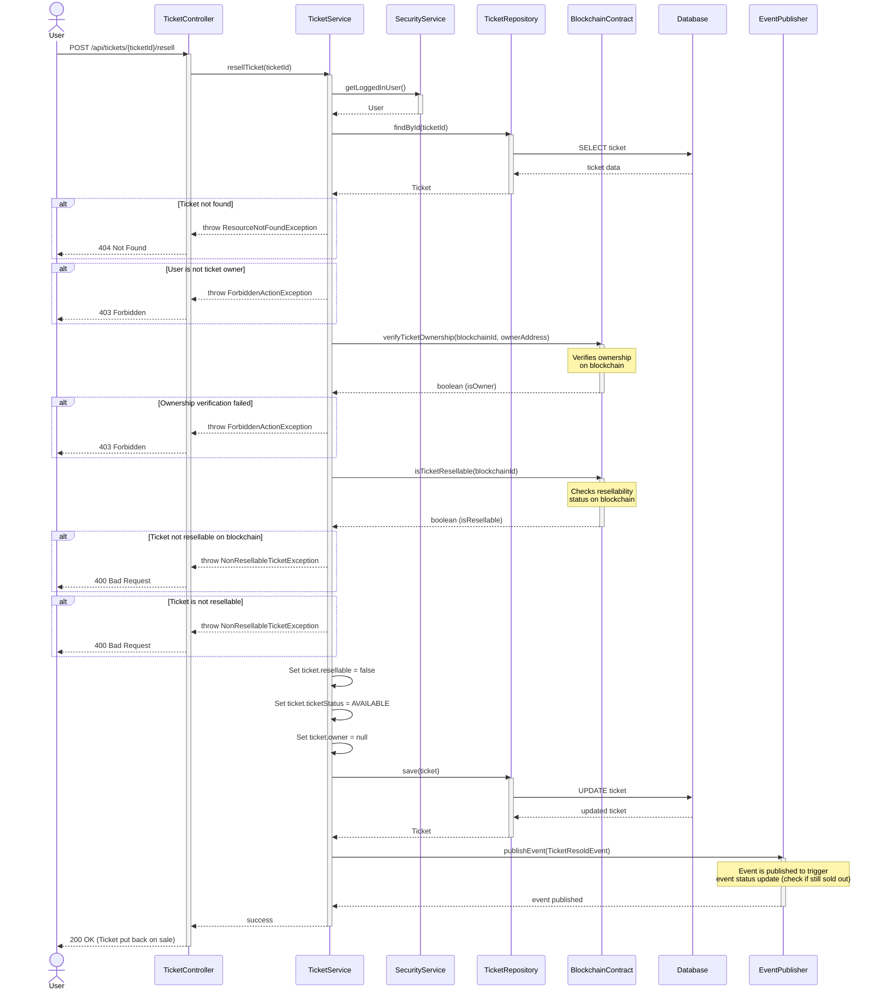

# UML Sequence Diagram - Ticket Resale

This diagram shows the sequence of interactions for reselling a ticket in the TicketBlock system.

```mermaid
sequenceDiagram
    actor User
    participant Controller as TicketController
    participant Service as TicketService
    participant SecurityService
    participant TicketRepo as TicketRepository
    participant TicketContract as BlockchainContract
    participant DB as Database

    User->>Controller: POST /api/tickets/{ticketId}/resell
    activate Controller
    
    Controller->>Service: resellTicket(ticketId)
    activate Service
    
    Service->>SecurityService: getLoggedInUser()
    activate SecurityService
    SecurityService-->>Service: User
    deactivate SecurityService
    
    Service->>TicketRepo: findById(ticketId)
    activate TicketRepo
    TicketRepo->>DB: SELECT ticket
    DB-->>TicketRepo: ticket data
    TicketRepo-->>Service: Ticket
    deactivate TicketRepo
    
    alt Ticket not found
        Service-->>Controller: throw ResourceNotFoundException
        Controller-->>User: 404 Not Found
    end
    
    alt User is not ticket owner
        Service-->>Controller: throw ForbiddenActionException
        Controller-->>User: 403 Forbidden
    end
    
    Service->>TicketContract: verifyTicketOwnership(blockchainId, ownerAddress)
    activate TicketContract
    Note over TicketContract: Verifies ownership<br/>on blockchain
    TicketContract-->>Service: boolean (isOwner)
    deactivate TicketContract
    
    alt Ownership verification failed
        Service-->>Controller: throw ForbiddenActionException
        Controller-->>User: 403 Forbidden
    end
    
    Service->>TicketContract: isTicketResellable(blockchainId)
    activate TicketContract
    Note over TicketContract: Checks resellability<br/>status on blockchain
    TicketContract-->>Service: boolean (isResellable)
    deactivate TicketContract
    
    alt Ticket not resellable on blockchain
        Service-->>Controller: throw NonResellableTicketException
        Controller-->>User: 400 Bad Request
    end
    
    alt Ticket is not resellable
        Service-->>Controller: throw NonResellableTicketException
        Controller-->>User: 400 Bad Request
    end
    
    Service->>Service: Set ticket.resellable = false
    Service->>Service: Set ticket.ticketStatus = AVAILABLE
    Service->>Service: Set ticket.owner = null
    
    Service->>TicketRepo: save(ticket)
    activate TicketRepo
    TicketRepo->>DB: UPDATE ticket
    DB-->>TicketRepo: updated ticket
    TicketRepo-->>Service: Ticket
    deactivate TicketRepo
    
    Service->>EventPublisher: publishEvent(TicketResoldEvent)
    activate EventPublisher
    Note over EventPublisher: Event is published to trigger<br/>event status update (check if still sold out)
    EventPublisher-->>Service: event published
    deactivate EventPublisher
    
    Service-->>Controller: success
    deactivate Service
    
    Controller-->>User: 200 OK (Ticket put back on sale)
    deactivate Controller
```
