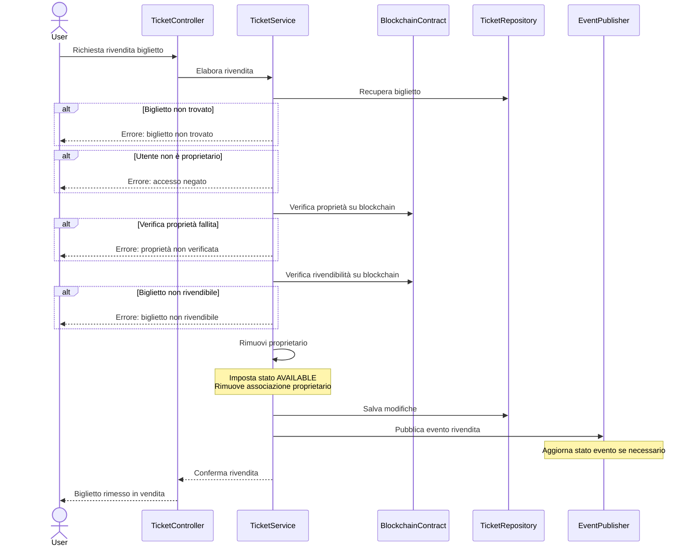

# Diagramma di Sequenza UML - Rivendita Biglietto

Questo diagramma mostra la sequenza di interazioni per la rivendita di un biglietto nel sistema TicketBlock.

```mermaid
sequenceDiagram
    actor User
    participant TicketController
    participant TicketService
    participant BlockchainContract
    participant TicketRepository
    participant EventPublisher

    User->>TicketController: Richiesta rivendita biglietto
    TicketController->>TicketService: Elabora rivendita
    
    TicketService->>TicketRepository: Recupera biglietto
    
    alt Biglietto non trovato
        TicketService-->>User: Errore: biglietto non trovato
    end
    
    alt Utente non è proprietario
        TicketService-->>User: Errore: accesso negato
    end
    
    TicketService->>BlockchainContract: Verifica proprietà su blockchain
    
    alt Verifica proprietà fallita
        TicketService-->>User: Errore: proprietà non verificata
    end
    
    TicketService->>BlockchainContract: Verifica rivendibilità su blockchain
    
    alt Biglietto non rivendibile
        TicketService-->>User: Errore: biglietto non rivendibile
    end
    
    TicketService->>TicketService: Rimuovi proprietario
    Note over TicketService: Imposta stato AVAILABLE<br/>Rimuove associazione proprietario
    
    TicketService->>TicketRepository: Salva modifiche
    TicketService->>EventPublisher: Pubblica evento rivendita
    Note over EventPublisher: Aggiorna stato evento se necessario
    
    TicketService-->>TicketController: Conferma rivendita
    TicketController-->>User: Biglietto rimesso in vendita
```
