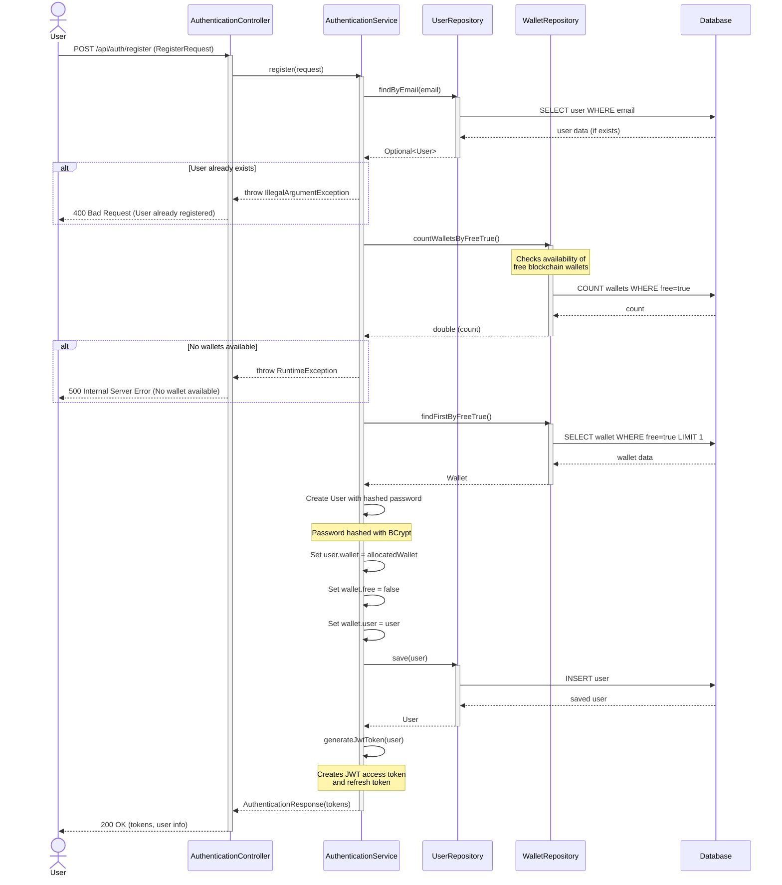

# UML Sequence Diagram - User Registration

This diagram shows the sequence of interactions for user registration with blockchain wallet allocation in the TicketBlock system.

```mermaid
sequenceDiagram
    actor User
    participant Controller as AuthenticationController
    participant Service as AuthenticationService
    participant UserRepo as UserRepository
    participant WalletRepo as WalletRepository
    participant DB as Database

    User->>Controller: POST /api/auth/register (RegisterRequest)
    activate Controller
    
    Controller->>Service: register(request)
    activate Service
    
    Service->>UserRepo: findByEmail(email)
    activate UserRepo
    UserRepo->>DB: SELECT user WHERE email
    DB-->>UserRepo: user data (if exists)
    UserRepo-->>Service: Optional<User>
    deactivate UserRepo
    
    alt User already exists
        Service-->>Controller: throw IllegalArgumentException
        Controller-->>User: 400 Bad Request (User already registered)
    end
    
    Service->>WalletRepo: countWalletsByFreeTrue()
    activate WalletRepo
    Note over WalletRepo: Checks availability of<br/>free blockchain wallets
    WalletRepo->>DB: COUNT wallets WHERE free=true
    DB-->>WalletRepo: count
    WalletRepo-->>Service: double (count)
    deactivate WalletRepo
    
    alt No wallets available
        Service-->>Controller: throw RuntimeException
        Controller-->>User: 500 Internal Server Error (No wallet available)
    end
    
    Service->>WalletRepo: findFirstByFreeTrue()
    activate WalletRepo
    WalletRepo->>DB: SELECT wallet WHERE free=true LIMIT 1
    DB-->>WalletRepo: wallet data
    WalletRepo-->>Service: Wallet
    deactivate WalletRepo
    
    Service->>Service: Create User with hashed password
    Note over Service: Password hashed with BCrypt
    Service->>Service: Set user.wallet = allocatedWallet
    Service->>Service: Set wallet.free = false
    Service->>Service: Set wallet.user = user
    
    Service->>UserRepo: save(user)
    activate UserRepo
    UserRepo->>DB: INSERT user
    DB-->>UserRepo: saved user
    UserRepo-->>Service: User
    deactivate UserRepo
    
    Service->>Service: generateJwtToken(user)
    Note over Service: Creates JWT access token<br/>and refresh token
    
    Service-->>Controller: AuthenticationResponse(tokens)
    deactivate Service
    
    Controller-->>User: 200 OK (tokens, user info)
    deactivate Controller
```
