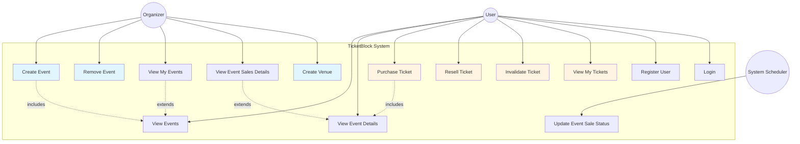

# Diagramma dei Casi d'Uso UML - Sistema TicketBlock

Questo diagramma mostra i principali casi d'uso e attori nel sistema di biglietteria TicketBlock.

## Descrizione Attori

### User (Utente)
Un utente registrato che può:
- Visualizzare gli eventi disponibili
- Acquistare biglietti (con o senza opzione di rivendita)
- Visualizzare i propri biglietti posseduti
- Rivendere biglietti acquistati (se rivendibili)
- Invalidare i propri biglietti (es. quando entra all'evento)

### Organizer (Organizzatore)
Un tipo speciale di utente (con ruolo ORGANIZER) che può:
- Creare nuovi eventi
- Rimuovere eventi (se non sono stati venduti biglietti)
- Creare venue
- Visualizzare i propri eventi organizzati
- Visualizzare i dettagli delle vendite dei propri eventi

### System Scheduler (Schedulatore di Sistema)
Processo automatico di sistema che:
- Aggiorna gli stati di vendita degli eventi in base alle date
- Apre le vendite quando arriva la data di inizio vendita
- Chiude le vendite un giorno prima dell'evento
- Viene eseguito quotidianamente a mezzanotte

## Casi d'Uso Principali

1. **Create Event**: L'organizzatore crea un nuovo evento con venue, date e prezzi
2. **Purchase Ticket**: L'utente acquista uno o più biglietti per un evento
3. **Resell Ticket**: L'utente rimette in vendita un biglietto acquistato in precedenza
4. **Invalidate Ticket**: L'utente segna un biglietto come usato/invalido (brucia l'NFT sulla blockchain)
5. **View Event Sales Details**: L'organizzatore visualizza le statistiche sulle vendite dei biglietti dei propri eventi

## Regole di Business

- Gli utenti possono acquistare massimo 4 biglietti per evento
- I biglietti possono essere acquistati con una fee opzionale (configurabile, attualmente 10%) per renderli rivendibili
- Gli eventi devono avere inizio vendita almeno 3 giorni prima della data dell'evento
- Le vendite si chiudono automaticamente 1 giorno prima dell'evento
- Gli organizzatori non possono eliminare eventi con biglietti venduti
- Ogni biglietto è rappresentato come un NFT sulla blockchain
