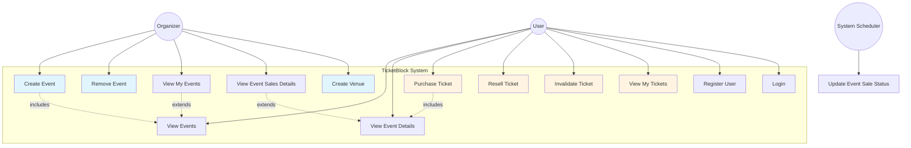

# UML Use Case Diagram - TicketBlock System

This diagram shows the main use cases and actors in the TicketBlock ticketing system.

## Actor Descriptions

### User
A registered user who can:
- View available events
- Purchase tickets (with or without resale option)
- View their owned tickets
- Resell purchased tickets (if resellable)
- Invalidate their tickets (e.g., when entering an event)

### Organizer
A special type of user (with ORGANIZER role) who can:
- Create new events
- Remove events (if no tickets sold)
- Create venues
- View their organized events
- View sales details for their events

### System Scheduler
Automated system process that:
- Updates event sale statuses based on dates
- Opens sales when sale start date arrives
- Closes sales one day before event
- Runs daily at midnight

## Main Use Cases

1. **Create Event**: Organizer creates a new event with venue, dates, and pricing
2. **Purchase Ticket**: User buys one or more tickets for an event
3. **Resell Ticket**: User puts a previously purchased ticket back on sale
4. **Invalidate Ticket**: User marks a ticket as used/invalid (burns NFT on blockchain)
5. **View Event Sales Details**: Organizer views statistics about ticket sales for their events

## Business Rules

- Users can purchase maximum 4 tickets per event
- Tickets can be purchased with 10% fee to make them resellable
- Events must have sales start at least 3 days before event date
- Sales close automatically 1 day before event
- Organizers cannot delete events with sold tickets
- Each ticket is represented as an NFT on the blockchain
